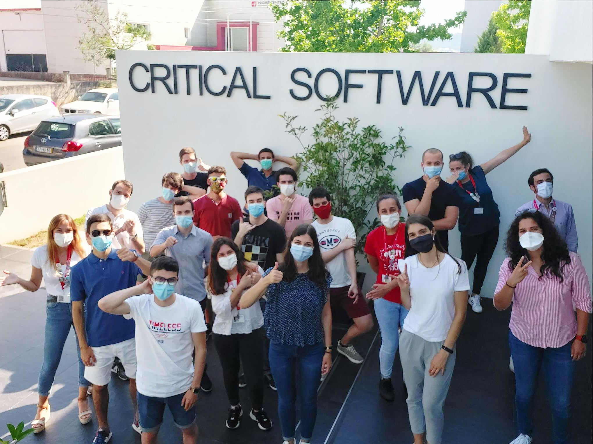

# Rodrigo Fernando Henriques Sobral

## :warning:__DISCLAIMER__ 

Peço desde já desculpa pela forma informal e por vezes humorística como este CV foi projetado. Não gosto muito de formalidades, apesar de as saber ter.

Não leve a mal, mas achei que tornaria tudo isto menos forçado e pesado para si de ler. Agora sim, vamos a isto! :muscle:

## Momento *Alta Definição* 

* 	2020

	Durante o verão, em plena pandemia mundial decido candidatar-me a um estágio na [`Critical Software`](https://www.criticalsoftware.com/pt). Porque não? Existiria melhor altura? 
	
* 	2019	
	
	Nas férias de verão fiz cursos online de POO, MYSQL, Redes, Linux e alguns conhecimentos avulsos.

* 	2018

	Entrei na Licenciatura de Engenharia Informática na Universidade de Coimbra.
	
* 	2011:arrow_right::skull:

	Depois de sonhar em entrar na força aérea portuguesa, aos cerca de 11 anos descobri a programação e rapidamente mudei de ideias, o que seria previsível para uma criança que já mexia em computadores desde os 4/5 anos.

	Nessa altura, cheguei à seguinte conclusão:

		while (1) {
			sucess= programming(me, my_pc);
		}
	

*	2000

	A 3 de janeiro no hospital de Viseu, o menino da profecia nasceu.

	Signo: :capricorn: (com ascendente em ganso e mapa astral de flamingo)
	
	
## Capaz de comunicar em :speech_balloon:
1) 🇵🇹	
2) 🇬🇧
3) 🇪🇸

## IDE/Editor de Texto de Escolha

* VISUAL STUDIO CODE	

## Hard Skills Adquiridas durante o Curso :mortar_board:

Do ponto de vista Junior! :baby:

Linguagem | Auto avaliação de conhecimento
--- | ---
Python | 				████████████████████
C | 					████████████████████
JavaScript |			██████████████████░░
Linux Programming (C) |	████████████████░░░░
OpenGL (C++) | 			███████████████░░░░░
Java |					█████████████░░░░░░░
Web Socket (C) | 		███████████░░░░░░░░░
Assembly | 				█████████░░░░░░░░░░░
HTML | 					████████░░░░░░░░░░░░
MATLAB |				███████░░░░░░░░░░░░░
CSS | 					███████░░░░░░░░░░░░░
OutSystems | 			██░░░░░░░░░░░░░░░░░░

## Hard Skills Adquiridas por conta própria :computer:

Do ponto de vista Junior! :baby:

Linguagem | Auto avaliação de conhecimento
--- | ---
MarkDown |	█████████████████░░░
Git | 		████████████████░░░░
MySQL | 	████████████████░░░░

## Conhecimentos Teóricos Adquiridos por conta própria :books:

Do ponto de vista Junior! :baby:

Área | Auto avaliação de conhecimento
--- | ---
Segurança e Hacking | 				██████████████████░░
Redes | 							█████████████████░░░
Hardware Computacional |			████████████████░░░░
Otimização de Código e Algoritmo |	████████████░░░░░░░░

## Soft Skills :thought_balloon:

As mais evidentes e possivelmente mais extremas:
- [x] Ambicioso
- [x] Decisivo
- [x] Improvisador
- [x] Metódico
- [x] Organizado
- [x] Responsável
- [x] Sugestivo

## Experiência Profissional :office:

- Estágio de verão dum 1 mês na [`Critical Software`](https://www.criticalsoftware.com/pt)

## Contactos

:necktie: [**LinkedIn**](https://www.linkedin.com/in/rodrigo-sobral-378080151/): Aqui sou uma pessoa séria.

:octocat: [**GitHub**](https://github.com/RodrigoSobral2000): Aqui dou um cheirinho daquilo que sei fazer.

:email:	[**EMAIL**](mailto:rodrigosobral@sapo.pt): E por fim mas não menos importante, aqui você contrata-me. :wink:

:phone: 926180923: Ou aqui, aqui também dá. :wink::wink:
